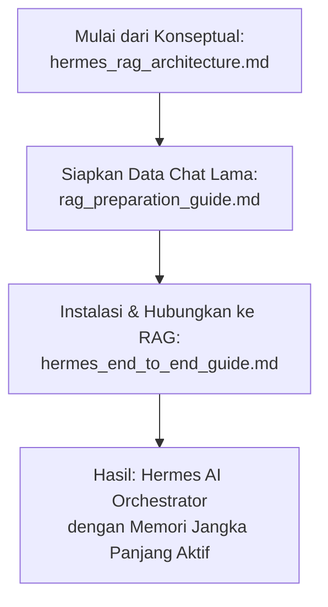

# Hermes Knowledge Base

Repositori ini berisi kumpulan dokumentasi, panduan, dan arsitektur untuk membangun dan mengonfigurasi **Hermes AI Orchestrator** dengan kemampuan Manajemen Memori berbasis **RAG (Retrieval-Augmented Generation)**. Dokumentasi di sini dirancang untuk membantu Anda memahami konsep arsitektur, menyiapkan data chat historis, hingga mengonfigurasi Hermes Agent secara end-to-end.

---

## Ringkasan dan Tujuan File

Berikut adalah ringkasan penjelasan dan tujuan dari setiap file dokumentasi yang ada di dalam repositori ini:

### 1. [hermes_end_to_end_guide.md](file:///c:/Users/eksad/OneDrive/Documents/GitHub/hermes-knowledge/hermes_end_to_end_guide.md)
* **Ringkasan**: Panduan operasional lengkap dari nol sampai sistem RAG aktif. Panduan ini mencakup langkah-langkah instalasi Hermes Agent di berbagai sistem operasi (khususnya Windows PowerShell), inisialisasi setup wizard, pengelolaan multi-profile/session, cara mengekspor riwayat percakapan menjadi file JSONL, konfigurasi file `config.yaml` untuk mengaktifkan RAG dan database vektor, serta teknik otomatisasi pencadangan chat harian menggunakan Cron Job atau Task Scheduler.
* **Tujuan**: Menjadi panduan utama (manual operasional) bagi pengguna yang ingin mengimplementasikan Hermes Agent secara praktis di mesin lokal mereka dan menghubungkannya dengan memori jangka panjang berbasis RAG.

### 2. [hermes_rag_architecture.md](file:///c:/Users/eksad/OneDrive/Documents/GitHub/hermes-knowledge/hermes_rag_architecture.md)
* **Ringkasan**: Dokumen konsep arsitektur yang menjelaskan bagaimana Hermes bertindak sebagai AI Orchestrator dengan *Memory Management* berbasis RAG. Dokumen ini merekomendasikan penyimpanan data mentah menggunakan JSON/JSONL demi kerapian metadata, menjelaskan 4 tahap pipeline RAG (Ekstraksi/Chunking, Embedding, Vector DB, dan Retrieval), serta merancang implementasi memori dinamis di Hermes menggunakan Custom Tools (`save_to_memory` dan `search_memory`).
* **Tujuan**: Memberikan pemahaman konseptual dan arsitektur sistem kepada pengembang mengenai bagaimana alur data memori diproses, disimpan, dan ditarik kembali oleh model AI.

### 3. [rag_preparation_guide.md](file:///c:/Users/eksad/OneDrive/Documents/GitHub/hermes-knowledge/rag_preparation_guide.md)
* **Ringkasan**: Panduan praktis untuk memproses dan mengonversi riwayat obrolan mentah dari platform eksternal (seperti ChatGPT atau Claude) menjadi format terstruktur JSONL yang kompatibel dengan RAG. Dokumen ini menyediakan *prompt* AI khusus yang siap pakai untuk mengotomatisasi konversi teks mentah menjadi JSON Lines, serta menjelaskan garis besar integrasi datanya menggunakan skrip Python ke ChromaDB.
* **Tujuan**: Membantu pengguna memformat ulang data percakapan lama dengan cepat dan otomatis tanpa perlu menulis berkas JSON manual baris demi baris.

---

## Hubungan Antar Dokumen (Alur Kerja)

Untuk membangun memori jangka panjang Hermes AI secara maksimal, Anda dapat mengikuti alur kerja berikut menggunakan dokumen yang tersedia:

1. **Pahami konsep dasarnya** terlebih dahulu melalui [hermes_rag_architecture.md](file:///c:/Users/eksad/OneDrive/Documents/GitHub/hermes-knowledge/hermes_rag_architecture.md).
2. **Kumpulkan dan bersihkan data chat lama** Anda dengan panduan dari [rag_preparation_guide.md](file:///c:/Users/eksad/OneDrive/Documents/GitHub/hermes-knowledge/rag_preparation_guide.md) agar menjadi format JSONL.
3. **Lakukan instalasi, konfigurasi RAG, dan otomatisasi pipeline** di sistem Anda dengan mengikuti langkah-langkah di [hermes_end_to_end_guide.md](file:///c:/Users/eksad/OneDrive/Documents/GitHub/hermes-knowledge/hermes_end_to_end_guide.md).
