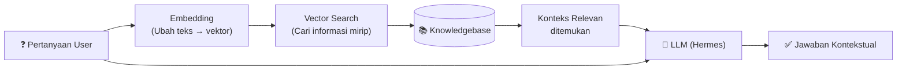
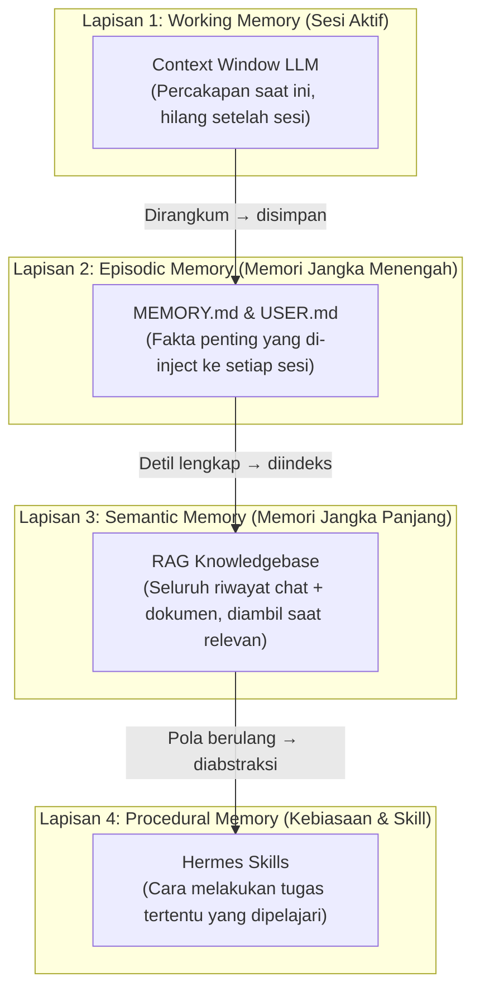

# Hermes AI Orchestrator: Panduan End-to-End (Dari Nol Sampai RAG)

Dokumen ini adalah panduan **step-by-step lengkap** untuk menginstal Hermes Agent, menyimpan seluruh riwayat chat, dan mengubahnya menjadi sumber pengetahuan RAG (Retrieval-Augmented Generation) sehingga Hermes menjadi AI Orchestrator yang memiliki "memori jangka panjang".

---

## 🧠 Fondasi Teori: Memahami Konsep di Balik Panduan Ini

Sebelum masuk ke langkah teknis, penting untuk memahami konsep-konsep inti yang mendasari seluruh arsitektur ini.

### Teori 1: Apa itu AI Orchestrator?

**AI Orchestrator** adalah sebuah sistem yang mengkoordinasikan berbagai komponen AI (model bahasa, tools, memori, dan agen) secara terpadu untuk menyelesaikan tugas yang kompleks. Berbeda dengan chatbot biasa yang hanya mengandalkan kemampuan model dasar, AI Orchestrator dapat:

- **Memanggil Tools** (*Function Calling*): Melakukan pencarian web, mengeksekusi kode, mengelola file, dan berinteraksi dengan API eksternal.
- **Mengelola Memori**: Menyimpan dan mengambil konteks dari percakapan masa lalu secara cerdas.
- **Multi-Agent Coordination**: Mendelegasikan sub-tugas ke agen AI khusus.
- **Pipeline Orchestration**: Mengatur alur kerja yang melibatkan banyak langkah berurutan.

Hermes adalah implementasi AI Orchestrator yang dirancang untuk berjalan secara lokal, memberikan privasi penuh sekaligus kemampuan yang setara dengan layanan cloud.

---

### Teori 2: Apa itu RAG (Retrieval-Augmented Generation)?

RAG adalah teknik yang menggabungkan dua kemampuan:
1. **Retrieval** (Pengambilan): Mengambil informasi yang relevan dari sumber data eksternal berdasarkan konteks pertanyaan.
2. **Generation** (Pembangkitan): Menggunakan informasi yang diambil tersebut untuk menghasilkan jawaban yang lebih akurat dan kontekstual.



**Mengapa RAG lebih baik dari fine-tuning?**

| Aspek | Fine-Tuning | RAG |
|---|---|---|  
| **Biaya** | Sangat mahal (GPU, waktu, data) | Murah (hanya storage + embedding) |
| **Update Data** | Harus latih ulang model | Cukup tambah file ke folder |
| **Akurasi Sumber** | Tidak bisa ditunjuk sumbernya | Bisa ditunjuk sumber dokumen aslinya |
| **Privasi** | Data terekspos ke cloud trainer | Data tetap lokal |
| **Waktu Setup** | Hari hingga minggu | Menit hingga jam |

> [!TIP]
> RAG adalah pendekatan yang dipilih Hermes karena memungkinkan Anda menambah "memori" baru kapan saja hanya dengan menambahkan file ke folder knowledgebase — tanpa perlu mengonfigurasi ulang model AI.

---

### Teori 3: Context Window dan Batas Memori LLM

Setiap model bahasa (LLM) memiliki keterbatasan yang disebut **Context Window** — batas maksimum jumlah teks (diukur dalam *token*) yang bisa diproses sekaligus dalam satu percakapan.

| Model | Context Window |
|---|---|
| GPT-4o | 128.000 token (~96.000 kata) |
| Claude 3.5 Sonnet | 200.000 token (~150.000 kata) |
| Llama 3.1 70B | 128.000 token |
| Gemma 2 9B | 8.192 token |

Masalahnya: jika percakapan Anda sudah berlangsung berbulan-bulan dengan ribuan pesan, **data tersebut tidak mungkin dimuat semua ke dalam context window**. RAG menyelesaikan masalah ini dengan hanya mengambil **potongan informasi yang paling relevan** (biasanya 5–10 chunk) dari ribuan data yang ada, sehingga LLM hanya perlu memproses bagian kecil yang benar-benar dibutuhkan.

---

## Daftar Isi

1. [Fase 1: Instalasi Hermes Agent](#fase-1-instalasi-hermes-agent)
2. [Fase 2: Konfigurasi Awal (Setup Wizard)](#fase-2-konfigurasi-awal-setup-wizard)
3. [Fase 3: Memahami Sistem Penyimpanan Chat Hermes](#fase-3-memahami-sistem-penyimpanan-chat-hermes)
4. [Fase 4: Ekspor Riwayat Chat ke JSONL](#fase-4-ekspor-riwayat-chat-ke-jsonl)
5. [Fase 5: Menyiapkan Folder Knowledgebase (RAG)](#fase-5-menyiapkan-folder-knowledgebase-rag)
6. [Fase 6: Konfigurasi RAG di Hermes](#fase-6-konfigurasi-rag-di-hermes)
7. [Fase 7: Mengaktifkan Memory Provider (Opsional - Level Lanjut)](#fase-7-mengaktifkan-memory-provider-opsional---level-lanjut)
8. [Fase 8: Verifikasi & Pengujian](#fase-8-verifikasi--pengujian)
9. [Fase 9: Otomatisasi (Auto-Logging ke RAG)](#fase-9-otomatisasi-auto-logging-ke-rag)
10. [Ringkasan Arsitektur](#ringkasan-arsitektur)

---

## Fase 1: Instalasi Hermes Agent

Pilih metode instalasi yang sesuai dengan sistem operasi Anda.

### Opsi A: Windows (PowerShell) — Direkomendasikan untuk Anda

Buka **PowerShell sebagai Administrator**, lalu jalankan:

```powershell
iex (irm https://hermes-agent.nousresearch.com/install.ps1)
```

### Opsi B: Linux / macOS (Terminal)

```bash
curl -fsSL https://hermes-agent.nousresearch.com/install.sh | bash
```

Setelah selesai, reload shell Anda:

```bash
source ~/.bashrc   # atau source ~/.zshrc
```

### Opsi C: Desktop Installer (GUI)

Download installer dari [website resmi Hermes Agent](https://hermes-agent.nousresearch.com/) dan jalankan seperti aplikasi biasa. Semua dependensi (Python, Node.js, dll.) akan ditangani otomatis.

### Verifikasi Instalasi

Setelah instalasi selesai, pastikan Hermes sudah terinstal dengan benar:

```bash
hermes --version
```

Anda seharusnya melihat output berupa nomor versi Hermes.

---

## Fase 2: Konfigurasi Awal (Setup Wizard)

### Step 1: Jalankan Setup Wizard

```bash
hermes setup
```

Wizard interaktif ini akan memandu Anda untuk mengatur konfigurasi dasar. Untuk cara tercepat, gunakan **Nous Portal** (gratis):

```bash
hermes setup --portal
```

> [!TIP]
> Flag `--portal` akan secara otomatis mengkonfigurasi LLM provider dan tool gateway (web search, image generation, dll.) tanpa perlu Anda memasukkan API key satu per satu.

### Step 2: Pilih Model AI

Jika Anda ingin mengkonfigurasi model secara manual (misalnya pakai OpenRouter atau endpoint lokal):

```bash
hermes model
```

Anda akan diminta memilih provider dan model yang ingin digunakan. Contoh pilihan:
- **OpenRouter** (bisa akses banyak model: GPT-4o, Claude, Llama, dll.)
- **Ollama** (model lokal, gratis, privasi tinggi)
- **OpenAI API** (langsung ke OpenAI)

### Step 3: Konfigurasi Tool/Gateway (Opsional)

Jika Anda ingin menghubungkan Hermes ke platform pesan:

```bash
hermes gateway setup
```

Pilihan: Telegram, Discord, Slack, WhatsApp, Email.

### Verifikasi Setup

Coba jalankan Hermes untuk pertama kalinya:

```bash
hermes
```

Anda akan masuk ke sesi chat interaktif. Coba ketik pertanyaan sederhana untuk memastikan semuanya berfungsi. Ketik `/exit` untuk keluar.

---

## Fase 3: Memahami Sistem Penyimpanan Chat Hermes

Sebelum mengekspor data, penting untuk memahami bagaimana Hermes menyimpan obrolan.

### 💡 Teori: Mengapa SQLite Dipilih sebagai Penyimpanan Internal?

Hermes menggunakan **SQLite** sebagai database internal bukan tanpa alasan. SQLite adalah database relasional berbasis file yang dirancang untuk di-*embed* langsung ke dalam aplikasi:

- **Serverless & Zero-Config**: Tidak memerlukan proses server terpisah. Database hidup sebagai satu file (`state.db`) yang bisa langsung diakses oleh aplikasi Hermes.
- **Atomic Write (ACID)**: Setiap operasi tulis bersifat *atomic* — artinya jika aplikasi crash di tengah penulisan, data tidak akan korup. Ini krusial untuk menjaga integritas riwayat chat.
- **Cross-Platform**: File `state.db` yang sama bisa dibuka di Windows, macOS, dan Linux tanpa konversi.
- **WAL Mode**: Hermes mengaktifkan *Write-Ahead Logging (WAL)* di SQLite, memungkinkan operasi baca dan tulis berlangsung secara bersamaan tanpa saling menghalangi.

> [!NOTE]
> Ini berbeda dengan MongoDB atau PostgreSQL yang memerlukan daemon server yang berjalan di latar belakang. Pilihan SQLite membuat Hermes bisa berjalan ringan di laptop maupun Raspberry Pi sekalipun.

### Struktur Penyimpanan Internal Hermes

```
~/.hermes/
├── config.yaml          # File konfigurasi utama
├── .env                 # API keys dan kredensial sensitif
├── state.db             # ⭐ Database SQLite utama (semua chat tersimpan di sini)
├── memories/
│   ├── MEMORY.md        # Memori umum yang di-inject ke system prompt
│   └── USER.md          # Profil user (preferensi, konteks personal)
├── workspace/           # Folder kerja persisten untuk dokumen/referensi
├── skills/              # Skill yang dipelajari Hermes
└── sessions/            # (Legacy) File sesi lama
```

> [!IMPORTANT]
> **Semua riwayat chat otomatis tersimpan** di `~/.hermes/state.db` (SQLite). Anda TIDAK perlu melakukan apa pun untuk menyimpan obrolan — Hermes sudah melakukannya secara otomatis sejak pertama kali Anda ngobrol.

### Perintah Manajemen Sesi

| Perintah | Fungsi |
|---|---|
| `hermes sessions list` | Lihat daftar semua sesi obrolan |
| `hermes sessions browse` | Jelajahi sesi secara interaktif |
| `hermes sessions export <file>.jsonl` | Ekspor sesi ke file JSONL |
| `hermes sessions archive --older-than 30d` | Arsipkan sesi lebih dari 30 hari |
| `hermes sessions compress` | Rangkum sesi lama untuk hemat ruang |

---

## Fase 4: Ekspor Riwayat Chat ke JSONL

Ini adalah langkah kunci: mengambil semua obrolan dari database internal Hermes dan mengekspornya menjadi file JSONL yang terstruktur.

### 💡 Teori: Mengapa Format JSONL (JSON Lines)?

Format **JSONL** (*JSON Lines*) adalah varian dari JSON di mana setiap baris merupakan satu objek JSON yang berdiri sendiri dan valid. Ini berbeda dari JSON biasa yang membungkus semua data dalam satu array besar.

```
# JSON biasa (seluruh array harus dimuat ke memori dulu)
[
  {"role": "user", "content": "Halo"},
  {"role": "assistant", "content": "Halo juga!"}
]

# JSONL (setiap baris independen — bisa dibaca streaming)
{"role": "user", "content": "Halo"}
{"role": "assistant", "content": "Halo juga!"}
```

**Keunggulan JSONL untuk Chat History:**

| Keunggulan | Penjelasan |
|---|---|
| **Streaming** | Bisa dibaca baris per baris tanpa memuat seluruh file ke RAM |
| **Append-Only** | Pesan baru cukup ditambahkan di baris akhir, tidak perlu parsing ulang seluruh file |
| **Parallelizable** | Pipeline chunking bisa memproses file secara paralel baris per baris |
| **Fault Tolerant** | Jika satu baris korup, baris lain tetap valid (berbeda dengan JSON array) |
| **Kompatibilitas** | Format standar yang didukung LangChain, LlamaIndex, HuggingFace Datasets, dll. |

> [!TIP]
> JSONL adalah format yang direkomendasikan oleh komunitas AI/ML untuk menyimpan dataset percakapan. OpenAI sendiri menggunakan format JSONL untuk fine-tuning dataset.

### 4.0: Di Mana Menjalankan Perintah Ekspor?

Semua perintah `hermes` dijalankan di **CLI (Command Line Interface)**, yaitu:

- **Windows:** Buka aplikasi **PowerShell** atau **Command Prompt** (tekan `Win + R`, ketik `powershell`, tekan Enter).
- **macOS:** Buka aplikasi **Terminal** (cari di Spotlight dengan `Cmd + Space`, ketik "Terminal").
- **Linux:** Buka aplikasi **Terminal** dari menu aplikasi Anda.

> [!IMPORTANT]
> **Anda TIDAK menjalankan perintah ini di dalam sesi chat Hermes.** Anda menjalankannya di terminal/PowerShell biasa, sebelum atau sesudah ngobrol dengan Hermes.

**Langkah detail untuk Windows:**
1. Tekan tombol `Win` di keyboard.
2. Ketik `PowerShell`.
3. Klik **Windows PowerShell** (tidak perlu "Run as Administrator" untuk ekspor).
4. Jendela biru PowerShell akan terbuka. Di sinilah Anda mengetikkan semua perintah `hermes ...` di bawah ini.

---

### 4.1: Memahami Sistem Profile di Hermes

Hermes memiliki fitur **Multi-Profile**, yang berarti Anda bisa membuat beberapa "identitas" AI yang terpisah satu sama lain. Setiap profile memiliki konfigurasi, memori, skill, dan riwayat chat **masing-masing yang terisolasi**.

**Perintah manajemen profile:**

| Perintah | Fungsi |
|---|---|
| `hermes profile list` | Lihat semua profile yang ada. Profile aktif ditandai dengan `*` |
| `hermes profile create <nama>` | Buat profile baru |
| `hermes profile create <nama> --clone` | Buat profile baru dengan meng-copy setting dari profile aktif |
| `hermes profile use <nama>` | Pindah ke profile lain (jadikan profile ini aktif untuk semua perintah selanjutnya) |
| `hermes profile export <nama>` | Ekspor seluruh profile (config + memori + chat) menjadi file `.tar.gz` |
| `hermes profile import <file.tar.gz>` | Impor profile dari file arsip |

**Contoh skenario profile:**
```
hermes profile list
```
Output:
```
  default          (created: 2026-06-01)
* coder            (created: 2026-06-15)   <-- profile aktif saat ini
  researcher       (created: 2026-07-01)
  personal-asst    (created: 2026-07-05)
```

> [!TIP]
> **Tip: Jalankan perintah untuk profile tertentu tanpa pindah profile.**
> Gunakan flag `-p` (atau `--profile`) untuk menargetkan profile spesifik tanpa mengubah profile aktif Anda:
> ```bash
> hermes -p researcher sessions list
> ```
> Perintah di atas akan menampilkan sesi chat dari profile "researcher", meskipun profile aktif Anda saat ini adalah "coder".

---

### 4.2: Ekspor Seluruh Riwayat Chat (Profile Aktif)

Buka PowerShell/Terminal, lalu jalankan:

```bash
hermes sessions export chat_history.jsonl
```

**Apa yang terjadi:**
- Hermes membaca database `state.db` dari **profile yang sedang aktif**.
- Semua sesi obrolan di profile tersebut diekspor ke dalam file `chat_history.jsonl`.
- File disimpan di **folder tempat Anda menjalankan perintah** (current working directory).

**Di mana file hasil ekspornya?**
File akan muncul di folder tempat PowerShell/Terminal Anda sedang berada. Biasanya ini adalah:
- **Windows:** `C:\Users\NamaAnda\` (home directory)
- **Linux/macOS:** `~/` (home directory)

Untuk memastikan, jalankan perintah ini setelah ekspor:

```powershell
# Windows PowerShell - cek file ada di mana
Get-ChildItem chat_history.jsonl

# Linux/macOS - cek file ada di mana
ls -la chat_history.jsonl
```

Atau, Anda bisa langsung tentukan path tujuan agar tidak bingung:

```bash
# Windows - simpan langsung ke folder tertentu
hermes sessions export C:\Users\eksad\OneDrive\Documents\GitHub\hermes-knowledge\chat_history.jsonl

# Linux/macOS - simpan langsung ke folder tertentu
hermes sessions export ~/hermes-knowledge/chat_history.jsonl
```

---

### 4.3: ⭐ Ekspor Per Profile (PENTING!)

Jika Anda punya beberapa profile dan ingin mengekspor chat dari **profile tertentu**, gunakan flag `-p`:

```bash
# Ekspor semua chat dari profile "coder"
hermes -p coder sessions export coder_chats.jsonl

# Ekspor semua chat dari profile "bussiness-analyst"
hermes -p bussiness-analyst sessions export bussiness-analyst_chats.jsonl

# Ekspor semua chat dari profile "researcher"
hermes -p researcher sessions export researcher_chats.jsonl

# Ekspor semua chat dari profile "personal-asst"
hermes -p personal-asst sessions export personal_chats.jsonl
```

**Atau pindah ke profile dulu, baru ekspor:**

```bash
# Pindah ke profile "researcher"
hermes profile use researcher

# Pindah ke profile "bussiness-analyst"
hermes profile use bussiness-analyst

# Pindah ke profile "coder"
hermes profile use coder

# Sekarang semua perintah akan menargetkan profile "researcher"
hermes sessions export researcher_all_chats.jsonl
```

**Ekspor SELURUH profile sekaligus (config + memori + chat):**

Jika Anda ingin backup total seluruh isi profile (bukan hanya chat, tapi juga konfigurasi, memori, dan skill):

```bash
# Ini akan membuat file arsip .tar.gz yang berisi SELURUH isi profile
hermes profile export coder
# Output: coder_profile_2026-07-09.tar.gz

# Ini akan membuat file arsip .tar.gz yang berisi SELURUH isi profile
hermes profile export bussiness-analyst
# Output: bussiness-analyst_profile_2026-07-09.tar.gz

# Ini akan membuat file arsip .tar.gz yang berisi SELURUH isi profile
hermes profile export researcher
# Output: researcher_profile_2026-07-09.tar.gz

# Ini akan membuat file arsip .tar.gz yang berisi SELURUH isi profile
hermes profile export personal-asst
# Output: personal-asst_profile_2026-07-09.tar.gz

```

---

### 4.4: Ekspor dengan Filter Lainnya

Anda juga bisa memfilter ekspor berdasarkan kriteria tertentu:

```bash
# Ekspor berdasarkan Session ID tertentu
hermes sessions export session_backup.jsonl --session-id <session_id>

# Ekspor hanya chat dari sumber Telegram
hermes -p personal-asst sessions export telegram_chats.jsonl --source telegram

# Ekspor hanya chat dari sumber Discord
hermes -p coder sessions export discord_chats.jsonl --source discord
```

> [!TIP]
> **Bagaimana cara mengetahui Session ID?**
> Jalankan `hermes sessions list` (atau `hermes -p <nama_profile> sessions list`) untuk melihat daftar semua sesi beserta ID-nya. Anda juga bisa menggunakan `hermes sessions browse` untuk menjelajahi sesi secara interaktif.

---

### 4.5: Simpan dari Dalam Sesi Chat (Manual)

Jika Anda **sedang di dalam sesi chat aktif** dengan Hermes dan ingin menyimpan percakapan saat itu juga, ketikkan slash command:

```
/save
```

File akan disimpan di folder default Hermes. Anda juga bisa menentukan nama file:

```
/save percakapan_setup_docker.jsonl
```

---

### 4.6: Cara Mengecek Isi File JSONL Hasil Ekspor

Setelah mengekspor, Anda mungkin ingin melihat isinya untuk memastikan datanya benar.

**Cara 1: Buka langsung di VS Code / Text Editor**
1. Buka **VS Code** (atau editor teks lain).
2. Tekan `Ctrl + O` (Open File).
3. Navigasikan ke lokasi file `chat_history.jsonl`.
4. File akan terbuka, dan Anda bisa melihat setiap baris berisi satu objek JSON.

**Cara 2: Lihat via PowerShell (Windows)**
```powershell
# Lihat 10 baris pertama dari file
Get-Content chat_history.jsonl -Head 10

# Lihat seluruh isi file (hati-hati jika file besar)
Get-Content chat_history.jsonl

# Hitung jumlah baris (= jumlah pesan)
(Get-Content chat_history.jsonl).Count
```

**Cara 3: Lihat via Terminal (Linux/macOS)**
```bash
# Lihat 10 baris pertama dari file
head -n 10 chat_history.jsonl

# Hitung jumlah baris (= jumlah pesan)
wc -l chat_history.jsonl
```

**Cara 4: Lihat via Hermes Dashboard (GUI)**
```bash
hermes dashboard
```
Ini akan membuka **Web Dashboard** di browser Anda. Dari sana, Anda bisa menjelajahi, menginspeksi, dan mengekspor sesi obrolan secara visual tanpa perlu perintah terminal.

---

### 4.7: Contoh Isi File `chat_history.jsonl`

Setiap baris berisi satu objek JSON. Begini tampilannya:

```json
{"session_id": "abc123", "timestamp": "2026-07-09T10:00:00", "role": "user", "content": "Bagaimana cara setup PostgreSQL di Windows?"}
{"session_id": "abc123", "timestamp": "2026-07-09T10:00:15", "role": "assistant", "content": "Untuk menginstal PostgreSQL di Windows, pertama download installer dari..."}
{"session_id": "def456", "timestamp": "2026-07-09T14:30:00", "role": "user", "content": "Jelaskan konsep Docker Compose."}
{"session_id": "def456", "timestamp": "2026-07-09T14:30:20", "role": "assistant", "content": "Docker Compose adalah tool untuk mendefinisikan dan menjalankan aplikasi multi-container..."}
```

> [!NOTE]
> File JSONL yang dihasilkan sudah berisi metadata lengkap: `role` (user/assistant), `content`, `timestamp`, `session_id`, `tool_calls`, dan `tool_results`. Formatnya sudah siap untuk diproses ke RAG.

---

## Fase 5: Menyiapkan Folder Knowledgebase (RAG)

Sekarang kita akan membuat struktur folder yang rapi untuk menampung semua materi RAG.

### Step 1: Buat Folder Knowledgebase

```bash
# Buat folder utama untuk RAG
mkdir -p ~/.hermes/knowledgebase

# Buat sub-folder untuk berbagai sumber data
mkdir -p ~/.hermes/knowledgebase/chat_exports
mkdir -p ~/.hermes/knowledgebase/documents
mkdir -p ~/.hermes/knowledgebase/notes
```

### Step 2: Pindahkan File JSONL ke Folder Knowledgebase

```bash
# Pindahkan hasil ekspor chat ke folder knowledgebase
cp chat_history.jsonl ~/.hermes/knowledgebase/chat_exports/
```

### Step 3: (Opsional) Tambahkan Dokumen Lain

Anda juga bisa menambahkan file `.md`, `.txt`, `.pdf`, atau `.json` lain ke folder `documents/` atau `notes/`. Hermes RAG akan mengindeks semuanya.

```bash
# Contoh: salin catatan kerja Anda
cp ~/Documents/catatan_meeting.md ~/.hermes/knowledgebase/notes/
cp ~/Documents/panduan_deployment.md ~/.hermes/knowledgebase/documents/
```

### Struktur Akhir Folder

```
~/.hermes/knowledgebase/
├── chat_exports/
│   ├── chat_history.jsonl          # ⭐ Semua chat yang diekspor
│   ├── telegram_chats.jsonl        # Chat dari Telegram (opsional)
│   └── discord_chats.jsonl         # Chat dari Discord (opsional)
├── documents/
│   ├── panduan_deployment.md       # Dokumen teknis
│   └── api_reference.md            # Referensi API
└── notes/
    ├── catatan_meeting.md          # Catatan rapat
    └── ide_proyek.md               # Ide-ide proyek
```

---

## Fase 6: Konfigurasi RAG di Hermes

Ini adalah langkah paling penting: menghubungkan folder knowledgebase Anda ke mesin RAG Hermes.

### 💡 Teori: Proses di Balik RAG — Dari File ke Jawaban

Ketika Anda mengaktifkan RAG di Hermes, ada empat tahap yang terjadi secara otomatis di balik layar:

#### Tahap 1: Chunking (Pemotongan Teks)

File-file di folder knowledgebase dipotong menjadi blok-blok teks yang lebih kecil, disebut **chunk**. Ini diperlukan karena tidak mungkin memasukkan seluruh isi knowledgebase ke dalam satu prompt sekaligus.

```
File chat_history.jsonl (misalnya 5MB, 2000 pesan)
           │
           ▼
   [Chunking Process]
           │
           ▼
  Chunk 1: "Sesi abc123 - Topik PostgreSQL setup"
  Chunk 2: "Sesi abc123 - Lanjutan PostgreSQL indexing"
  Chunk 3: "Sesi def456 - Topik Docker Compose"
  ... (ratusan atau ribuan chunk)
```

**Strategi chunking yang umum:**
- **Fixed-size**: Potong setiap N karakter/token (sederhana, cepat)
- **Semantic/Paragraph**: Potong berdasarkan paragraf atau makna (lebih cerdas)
- **Session-aware**: Untuk chat history, satu *sesi obrolan* diperlakukan sebagai satu unit chunk (strategi yang digunakan Hermes)

#### Tahap 2: Embedding (Mengubah Teks Menjadi Vektor)

Setiap chunk diubah menjadi representasi numerik berdimensi tinggi (vektor) menggunakan **model embedding**. Teks yang memiliki makna serupa akan menghasilkan vektor yang berdekatan secara matematis.

```
"Cara setup PostgreSQL di Windows"  →  [0.12, -0.45, 0.88, ..., 0.33]  (1536 dimensi)
"Install PostgreSQL pada Windows 11"→  [0.11, -0.44, 0.87, ..., 0.31]  (sangat mirip!)
"Cara memasak nasi goreng"          →  [-0.72, 0.19, -0.56, ..., 0.88] (sangat berbeda)
```

**Model embedding yang didukung Hermes:**

| Opsi | Konfigurasi | Kualitas | Privasi | Biaya |
|---|---|---|---|---|
| `local` | `embedding_model: local` | Baik | ✅ Penuh | Gratis |
| `ollama` | `embedding_model: ollama` | Sangat Baik | ✅ Penuh | Gratis |
| `openai` | `embedding_model: openai` | Terbaik | ⚠️ Cloud | Berbayar |

#### Tahap 3: Indexing ke Vector Database

Vektor-vektor hasil embedding disimpan ke dalam **Vector Database** (seperti ChromaDB atau Qdrant). Vector DB dioptimalkan untuk satu operasi kunci: mencari vektor yang paling *mirip* dari kumpulan jutaan vektor dengan sangat cepat menggunakan algoritma **HNSW** (*Hierarchical Navigable Small World*).

#### Tahap 4: Retrieval (Saat Anda Bertanya)

Setiap kali Anda mengetik pertanyaan ke Hermes:
1. Pertanyaan Anda di-embed menjadi vektor query.
2. Vector DB mencari N chunk yang vektornya paling dekat dengan vektor query (**cosine similarity search**).
3. Teks dari chunk-chunk tersebut diambil dan disisipkan ke dalam system prompt Hermes sebagai "konteks memori".
4. Hermes menjawab berdasarkan pertanyaan Anda + konteks yang ditemukan.

> [!IMPORTANT]
> Parameter `max_context_chunks: 8` di `config.yaml` mengontrol berapa banyak chunk yang diambil per query. Nilai lebih tinggi = lebih banyak konteks tapi context window lebih cepat penuh. Nilai 5–10 adalah sweet spot untuk kebanyakan kasus penggunaan.

### Step 1: Buka File Konfigurasi

```bash
hermes config edit
```

Ini akan membuka file `~/.hermes/config.yaml` di editor default Anda.

### Step 2: Tambahkan Konfigurasi Knowledgebase

Tambahkan blok berikut ke dalam file `config.yaml`:

```yaml
# ================================================
# KONFIGURASI RAG (KNOWLEDGEBASE)
# ================================================
knowledgebase:
  enabled: true
  directories:
    - ~/.hermes/knowledgebase/chat_exports    # Riwayat chat
    - ~/.hermes/knowledgebase/documents       # Dokumen teknis
    - ~/.hermes/knowledgebase/notes           # Catatan personal
    - ~/.hermes/workspace                     # Folder kerja Hermes
  auto_retrieve: true              # ⭐ Otomatis inject konteks relevan saat chat
  max_context_chunks: 8            # Jumlah chunk yang di-inject per query
  embedding_model: local           # Pilihan: "local", "openai", "ollama"
  reindex_on_change: true          # ⭐ Otomatis re-index saat file berubah
```

> [!IMPORTANT]
> **Penjelasan Parameter Kunci:**
> - `auto_retrieve: true` → Hermes akan **secara otomatis** mencari dan menarik informasi relevan dari knowledgebase saat Anda bertanya, tanpa perlu Anda mengetik `@` atau referensi file manual.
> - `reindex_on_change: true` → Jika Anda menambahkan file baru ke folder knowledgebase, Hermes akan otomatis mengindeksnya.
> - `embedding_model: local` → Menggunakan model embedding lokal (gratis, privasi tinggi). Ganti ke `"ollama"` jika Anda sudah punya Ollama terinstal, atau `"openai"` jika ingin kualitas embedding terbaik (berbayar).

### Step 3: Simpan dan Restart

Simpan file konfigurasi, lalu restart Hermes agar perubahan diterapkan:

```bash
# Mulai sesi baru — Hermes akan membaca config terbaru
hermes
```

Saat pertama kali dijalankan setelah konfigurasi RAG, Hermes akan melakukan **indexing awal** (membaca semua file di folder knowledgebase, memotongnya menjadi chunks, dan membuat embedding). Proses ini mungkin memakan waktu beberapa menit tergantung jumlah data.

---

## Fase 7: Mengaktifkan Memory Provider (Opsional - Level Lanjut)

Selain RAG berbasis file, Hermes juga mendukung **memory provider eksternal** untuk memori yang lebih cerdas dan semantik.

### 💡 Teori: Hierarki Memori dalam Sistem AI

Dalam desain sistem AI modern, memori tidak diperlakukan sebagai satu monolith, melainkan dipisahkan menjadi beberapa lapisan berdasarkan fungsi dan persistensinya:



**Penjelasan setiap lapisan:**

| Lapisan | Analogi Manusia | Teknologi di Hermes | Persistensi |
|---|---|---|---|
| Working Memory | Ingatan dalam percakapan langsung | Context Window LLM | Hilang saat sesi berakhir |
| Episodic Memory | "Saya ingat pertemuan kemarin" | `MEMORY.md` + `USER.md` | Persisten, diambil tiap sesi |
| Semantic Memory | "Saya tahu cara memasak" | RAG Knowledgebase | Persisten, diambil saat relevan |
| Procedural Memory | Kebiasaan & kemampuan motorik | Hermes Skills & Automations | Permanen |

Memory Provider eksternal (Mem0, Honcho, Hindsight) bertugas **mengotomatisasi manajemen lapisan 2 dan 3** — secara cerdas memutuskan informasi mana yang layak disimpan ke memori jangka panjang dan mana yang boleh dilupakan.

### Step 1: Setup Memory Provider

```bash
hermes memory setup
```

Wizard interaktif akan menampilkan pilihan provider:

| Provider | Deskripsi | Cocok Untuk |
|---|---|---|
| **Hindsight** | Memory provider ringan, lokal | Penggunaan personal |
| **Mem0** | Memory management AI-powered | Memori semantik canggih |
| **Honcho** | Session-aware memory | Aplikasi multi-user |

### Step 2: Konfigurasi Manual (Alternatif)

Tambahkan ke `~/.hermes/config.yaml`:

```yaml
# ================================================
# KONFIGURASI MEMORY PROVIDER
# ================================================
memory:
  provider: hindsight    # atau: honcho, mem0
```

### Step 3: Install Skill Vector DB (Opsional)

Untuk performa RAG yang lebih tinggi, Anda bisa menginstal skill vector database:

```bash
# ChromaDB — open-source, lokal, mudah
hermes skills install official/mlops/chroma

# Qdrant — production-grade, performa tinggi
hermes skills install official/mlops/qdrant
```

---

## Fase 8: Verifikasi & Pengujian

Sekarang saatnya memastikan semuanya bekerja.

### Test 1: Cek Status Knowledgebase

```bash
hermes config
```

Pastikan bagian `knowledgebase` menunjukkan `enabled: true` dan daftar direktori Anda sudah benar.

### Test 2: Mulai Sesi Chat dan Tanyakan Sesuatu dari Masa Lalu

```bash
hermes
```

Lalu coba tanyakan sesuatu yang pernah Anda bahas sebelumnya. Contoh:

```
Kamu: Kemarin kita pernah bahas cara setup PostgreSQL, bisa ingatkan langkah-langkahnya?
```

Jika RAG bekerja dengan benar, Hermes akan menarik konteks dari file `chat_history.jsonl` di knowledgebase dan memberikan jawaban yang berdasarkan obrolan lama Anda.

### Test 3: Verifikasi Memori Built-in

Cek isi file memori bawaan:

```bash
cat ~/.hermes/memories/MEMORY.md
cat ~/.hermes/memories/USER.md
```

File `MEMORY.md` berisi hal-hal penting yang Hermes ingat, dan `USER.md` berisi profil preferensi Anda.

---

## Fase 9: Otomatisasi (Auto-Logging ke RAG)

Agar sistem ini berjalan terus-menerus tanpa campur tangan manual, kita bisa membuat **jadwal otomatis** yang secara berkala mengekspor chat baru dan memasukkannya ke knowledgebase.

### Opsi A: Menggunakan Cron Job (Linux/macOS)

Buat script `auto_export.sh`:

```bash
#!/bin/bash
# auto_export.sh - Ekspor chat terbaru ke knowledgebase setiap hari

DATE=$(date +%Y-%m-%d)
EXPORT_DIR="$HOME/.hermes/knowledgebase/chat_exports"

# Ekspor chat hari ini
hermes sessions export "$EXPORT_DIR/chat_$DATE.jsonl" --after "$(date -d 'yesterday' +%Y-%m-%d)"

echo "[$(date)] Chat exported to $EXPORT_DIR/chat_$DATE.jsonl"
```

Jadwalkan dengan cron (jalankan setiap tengah malam):

```bash
crontab -e
# Tambahkan baris berikut:
0 0 * * * /bin/bash ~/auto_export.sh >> ~/hermes_export.log 2>&1
```

### Opsi B: Menggunakan Task Scheduler (Windows)

Buat script PowerShell `auto_export.ps1`:

```powershell
# auto_export.ps1 - Ekspor chat terbaru ke knowledgebase

$date = Get-Date -Format "yyyy-MM-dd"
$exportDir = "$env:USERPROFILE\.hermes\knowledgebase\chat_exports"

# Pastikan folder ada
if (!(Test-Path $exportDir)) { New-Item -ItemType Directory -Path $exportDir -Force }

# Ekspor chat
hermes sessions export "$exportDir\chat_$date.jsonl"

Write-Output "[$(Get-Date)] Chat exported to $exportDir\chat_$date.jsonl"
```

Jadwalkan via **Task Scheduler** Windows untuk berjalan setiap hari.

### Opsi C: Menggunakan Hermes Sendiri (Paling Elegan)

Hermes mendukung *scheduled automations*. Dari dalam sesi chat Hermes, Anda bisa memerintahkan:

```
Kamu: Tolong buat jadwal otomatis setiap tengah malam untuk mengekspor semua chat hari ini
      ke folder ~/.hermes/knowledgebase/chat_exports/ dalam format JSONL.
```

Hermes akan menggunakan tool `cron_manage` internal untuk membuat jadwal ini.

---

## Ringkasan Arsitektur

Berikut adalah gambaran besar alur data dari nol sampai RAG aktif.

### 💡 Teori: Mengapa Arsitektur Ini Penting — Prinsip "Separation of Concerns"

Arsitektur Hermes RAG dirancang berdasarkan prinsip **Separation of Concerns (SoC)** — setiap komponen memiliki tanggung jawab yang jelas dan terisolasi:

| Komponen | Tanggung Jawab Tunggal |
|---|---|
| `state.db` (SQLite) | Menyimpan data mentah chat dengan aman & cepat |
| `chat_history.jsonl` | Format portabel untuk pertukaran & pemrosesan data |
| `knowledgebase/` folder | Repositori terpusat semua sumber pengetahuan |
| Vector Database | Pencarian semantik berdimensi tinggi |
| LLM (model AI) | Pembangkitan respons berdasarkan konteks |

Dengan memisahkan komponen ini, Anda bisa mengganti salah satu bagian (misalnya ganti vector DB dari ChromaDB ke Qdrant) tanpa memengaruhi bagian lain. Inilah yang disebut **loosely coupled architecture**.

### 💡 Teori: Data Flow — Append-Only Log sebagai Sumber Kebenaran

Seluruh sistem ini dibangun di atas konsep **append-only log**: data chat yang sudah tersimpan tidak pernah diubah, hanya ditambahkan. Ini adalah pola yang digunakan oleh sistem-sistem berskala besar (Apache Kafka, event sourcing pattern) karena:

- **Audit Trail**: Selalu ada rekaman lengkap apa yang terjadi.
- **Idempotency**: Menjalankan pipeline embedding berkali-kali menghasilkan hasil yang sama.
- **Disaster Recovery**: Jika vector DB rusak, cukup rebuild dari file JSONL.

```
┌─────────────────────────────────────────────────────────────────────┐
│                    HERMES AI ORCHESTRATOR                            │
│                                                                     │
│  ┌──────────┐    Auto-Save    ┌──────────────┐                     │
│  │  Chat    │ ──────────────> │  state.db    │                     │
│  │  Session │                 │  (SQLite)    │                     │
│  └──────────┘                 └──────┬───────┘                     │
│                                      │                              │
│                          hermes sessions export                     │
│                                      │                              │
│                                      ▼                              │
│                         ┌────────────────────┐                     │
│                         │  chat_history.jsonl │                     │
│                         └─────────┬──────────┘                     │
│                                   │                                 │
│                              Copy ke folder                        │
│                                   │                                 │
│                                   ▼                                 │
│  ┌─────────────────────────────────────────────────────────┐       │
│  │              ~/.hermes/knowledgebase/                     │       │
│  │  ┌──────────────┐  ┌───────────┐  ┌──────────┐         │       │
│  │  │ chat_exports │  │ documents │  │  notes   │         │       │
│  │  │  (JSONL)     │  │ (MD/TXT)  │  │ (MD)     │         │       │
│  │  └──────┬───────┘  └─────┬─────┘  └────┬─────┘         │       │
│  └─────────┼────────────────┼─────────────┼────────────────┘       │
│            └────────────────┼─────────────┘                         │
│                             │                                       │
│                    Chunking + Embedding                             │
│                    (auto via config.yaml)                           │
│                             │                                       │
│                             ▼                                       │
│                  ┌────────────────────┐                             │
│                  │   Vector Database  │                             │
│                  │  (Built-in/Chroma) │                             │
│                  └─────────┬──────────┘                             │
│                            │                                        │
│                   Similarity Search                                 │
│                   (auto_retrieve: true)                             │
│                            │                                        │
│                            ▼                                        │
│                  ┌────────────────────┐                             │
│                  │  System Prompt +   │                             │
│                  │  Retrieved Context │──────> Jawaban Hermes       │
│                  │  + User Query      │        yang Kontekstual     │
│                  └────────────────────┘                             │
│                                                                     │
└─────────────────────────────────────────────────────────────────────┘
```

### Checklist Ringkas

- [ ] **Fase 1:** Instal Hermes Agent
- [ ] **Fase 2:** Jalankan `hermes setup` dan pilih model
- [ ] **Fase 3:** Mulai chatting (data otomatis tersimpan di `state.db`)
- [ ] **Fase 4:** Ekspor chat: `hermes sessions export chat_history.jsonl`
- [ ] **Fase 5:** Buat folder `~/.hermes/knowledgebase/` dan pindahkan file JSONL
- [ ] **Fase 6:** Edit `config.yaml` → aktifkan `knowledgebase` dengan `auto_retrieve: true`
- [ ] **Fase 7:** (Opsional) Setup memory provider: `hermes memory setup`
- [ ] **Fase 8:** Test dengan bertanya tentang obrolan lama
- [ ] **Fase 9:** Setup auto-export harian (cron/Task Scheduler)

> [!CAUTION]
> **Penting:** Pastikan Anda TIDAK menyimpan API key atau kredensial sensitif di dalam folder knowledgebase. Gunakan file `~/.hermes/.env` untuk semua data sensitif. Perintah `hermes sessions export` sudah otomatis meredaksi API keys dan token dari hasil ekspor.
