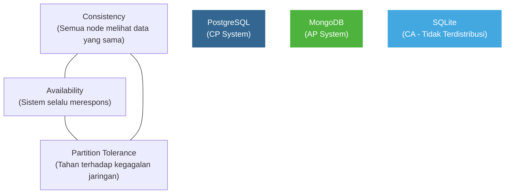
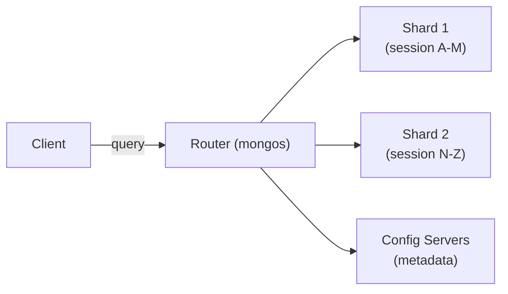
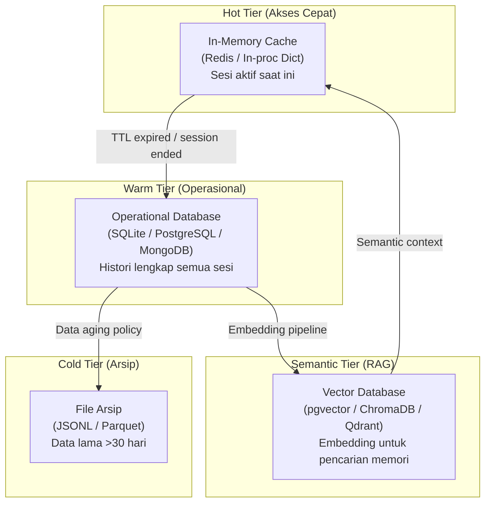
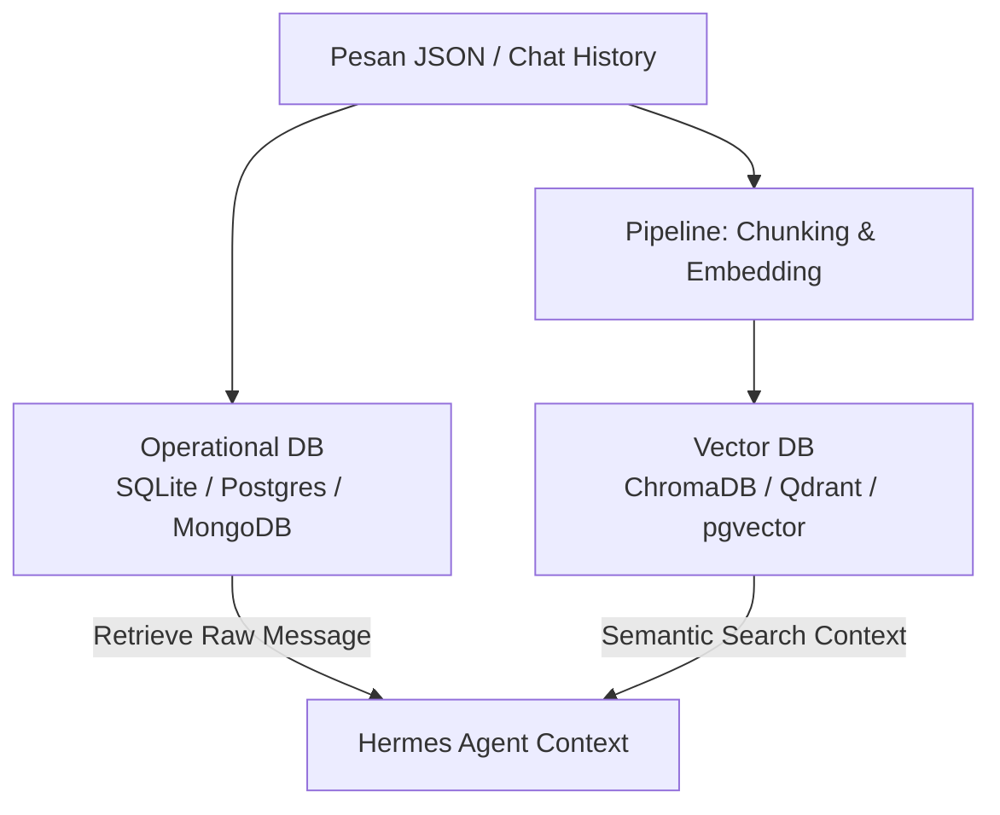

# Rekomendasi Database untuk Menyimpan Chat History JSON/JSONL

Dokumen ini berisi rekomendasi database terbaik untuk menyimpan chat history berformat JSON/JSONL dalam pengembangan **Hermes AI Orchestrator** atau aplikasi berbasis RAG (*Retrieval-Augmented Generation*), dilengkapi dengan teori-teori fundamental yang mendasari setiap pilihan.

---

## Fondasi Teori: Sebelum Memilih Database

Sebelum memilih database, ada beberapa teori fundamental yang harus dipahami karena menjadi pijakan dari semua keputusan teknis di bawah ini.

### Teori 1: ACID vs BASE

Dua paradigma konsistensi data yang paling fundamental dalam sistem database:

| Properti | ACID | BASE |
|---|---|---|
| **Singkatan** | Atomicity, Consistency, Isolation, Durability | Basically Available, Soft-state, Eventually Consistent |
| **Filosofi** | "Data harus selalu benar setiap saat" | "Data akan menjadi benar pada akhirnya" |
| **Cocok untuk** | Transaksi finansial, data kritis | Sistem terdistribusi berskala besar, media sosial |
| **Contoh DB** | PostgreSQL, SQLite, MySQL | MongoDB, Cassandra, CouchDB |

**Relevansi untuk Chat:** Data obrolan umumnya tidak membutuhkan konsistensi level transaksi finansial. Namun jika Hermes mengelola banyak pengguna secara bersamaan, memahami trade-off ini menjadi krusial.

> [!NOTE]
> Untuk chat history yang digunakan sebagai memori AI, konsistensi eventual (BASE) umumnya sudah cukup. Yang lebih penting adalah **kecepatan baca** (read throughput) dan **fleksibilitas kueri semantik**.

---

### Teori 2: Teorema CAP

Teorema CAP (Brewer's Theorem, 2000) menyatakan bahwa sistem database terdistribusi hanya dapat menjamin **dua dari tiga** properti berikut secara bersamaan:



- **PostgreSQL** → Memilih **Consistency + Partition Tolerance (CP)**. Data dijamin konsisten meski jaringan terganggu.
- **MongoDB** → Memilih **Availability + Partition Tolerance (AP)**. Sistem tetap responsif, namun ada jeda sebelum data sinkron antar node.
- **SQLite** → Tidak terdistribusi, sehingga tidak ada masalah partisi jaringan (beroperasi di luar CAP).

---

### Teori 3: Model Data — Relasional vs Dokumen vs Key-Value

Pilihan model data menentukan bagaimana chat JSON disimpan, diambil, dan dikueri:

| Model | Representasi Data | Kekuatan | Kelemahan |
|---|---|---|---|
| **Relasional** | Tabel dengan baris & kolom | Kueri kompleks, integritas data kuat | Kurang fleksibel untuk skema dinamis |
| **Dokumen** | Dokumen JSON/BSON mandiri | Skema fleksibel, natural untuk data JSON | Kueri lintas-dokumen lebih lambat |
| **Key-Value** | Pasangan kunci → nilai | Sangat cepat untuk akses langsung | Kemampuan kueri terbatas |
| **Vektor** | Array angka berdimensi tinggi | Pencarian kemiripan semantik | Tidak cocok untuk data terstruktur biasa |

---

## 1. PostgreSQL — Teori, Kelebihan & Pertimbangan

### Teori Internal: Bagaimana `JSONB` Bekerja?

PostgreSQL menyediakan dua tipe kolom untuk data JSON: `JSON` dan `JSONB`. Perbedaannya bersifat fundamental:

| Aspek | `JSON` | `JSONB` |
|---|---|---|
| **Penyimpanan** | Teks mentah (raw text) | Format biner terdekomposisi |
| **Validasi** | Saat *insert* | Saat *insert* |
| **Kecepatan Tulis** | Lebih cepat | Sedikit lebih lambat |
| **Kecepatan Baca/Kueri** | Lebih lambat (parse tiap kali) | **Jauh lebih cepat** (sudah di-parse) |
| **Pengindeksan** | Tidak mendukung GIN | **Mendukung GIN & Hash Index** |
| **Duplikasi Key** | Dipertahankan | Dihapus (key terakhir yang dipakai) |

Untuk menyimpan chat history, **selalu gunakan `JSONB`** karena frekuensi baca data jauh lebih tinggi daripada penulisan.

### Teori GIN Index (Generalized Inverted Index)

GIN Index adalah struktur indeks yang sangat cocok untuk tipe data yang mengandung banyak nilai di dalamnya (seperti array atau objek JSON). Alih-alih mengindeks seluruh dokumen, GIN mengindeks **setiap elemen di dalam** dokumen secara terpisah.

```sql
-- Contoh skema tabel untuk menyimpan chat history
CREATE TABLE chat_messages (
    id          SERIAL PRIMARY KEY,
    session_id  VARCHAR(64) NOT NULL,
    created_at  TIMESTAMPTZ DEFAULT NOW(),
    payload     JSONB NOT NULL
);

-- Buat GIN Index agar kueri ke dalam payload JSONB sangat cepat
CREATE INDEX idx_chat_payload ON chat_messages USING GIN (payload);

-- Contoh kueri: cari semua pesan dari role 'user'
SELECT * FROM chat_messages
WHERE payload @> '{"role": "user"}';
```

### Teori `pgvector` — Unified Storage untuk RAG

Ekstensi `pgvector` mengimplementasikan tipe data `vector` dan algoritma pencarian **ANN (Approximate Nearest Neighbor)** menggunakan metode **HNSW (Hierarchical Navigable Small World)** atau **IVFFlat**.

```sql
-- Aktifkan ekstensi
CREATE EXTENSION IF NOT EXISTS vector;

-- Tambahkan kolom vektor ke tabel
ALTER TABLE chat_messages ADD COLUMN embedding vector(1536);

-- Buat HNSW Index untuk pencarian kemiripan yang cepat
CREATE INDEX ON chat_messages USING hnsw (embedding vector_cosine_ops);

-- Kueri: cari 5 pesan yang paling mirip secara semantik
SELECT session_id, payload->>'content'
FROM chat_messages
ORDER BY embedding <=> '[0.1, 0.2, ...]'::vector
LIMIT 5;
```

### Pertimbangan & Trade-off PostgreSQL

| ✅ Kelebihan | ❌ Kekurangan |
|---|---|
| ACID penuh — data tidak akan korup | Butuh setup server (tidak bisa berjalan tanpa instalasi) |
| `JSONB` + GIN index = kueri JSON yang sangat cepat | *Overhead* lebih tinggi untuk proyek kecil |
| `pgvector` menghilangkan kebutuhan vector DB terpisah | Scaling horizontal (sharding) lebih rumit dibanding MongoDB |
| SQL standar yang sudah dikenal luas | Konsumsi RAM lebih tinggi saat banyak koneksi |
| Cocok untuk multi-user production environment | Membutuhkan manajemen koneksi (*connection pooling*) |

---

## 2. MongoDB — Teori, Kelebihan & Pertimbangan

### Teori Internal: Apa itu BSON?

BSON (*Binary JSON*) adalah format serialisasi biner yang digunakan MongoDB. Berbeda dengan JSON biasa (teks), BSON menyimpan informasi **tipe data** secara eksplisit dan mendukung tipe yang tidak ada di JSON standar.

| Fitur | JSON | BSON |
|---|---|---|
| Format | Teks | Biner |
| Tipe data | String, Number, Boolean, Null, Array, Object | Semua JSON + `Date`, `ObjectId`, `Binary`, `Decimal128`, `Regex` |
| Kecepatan parse | Lebih lambat | Lebih cepat |
| Ukuran file | Lebih kecil (teks) | Bisa lebih besar, namun lebih cepat dibaca |

Untuk chat history, `Date` dan `ObjectId` dari BSON sangat berguna:
- **`ObjectId`** sebagai `_id` sudah mengandung informasi *timestamp* pembuatan dokumen secara bawaan.
- **`Date`** menyimpan waktu dengan presisi milidetik tanpa perlu konversi dari string.

### Teori Sharding & Horizontal Scaling

MongoDB dirancang dari awal untuk *horizontal scaling* melalui mekanisme **Sharding**:



Dengan menggunakan `session_id` sebagai **shard key**, semua pesan dari satu sesi obrolan dijamin berada di shard yang sama, sehingga kueri per-sesi berjalan tanpa memerlukan *cross-shard join*.

### Teori Schema-less (Schemaless Design)

MongoDB menganut prinsip *schema-less* yang memungkinkan setiap dokumen dalam koleksi yang sama memiliki struktur berbeda. Ini sangat berguna untuk chat history dari berbagai platform:

```json
// Dokumen dari Hermes CLI
{ "session_id": "h-001", "role": "user", "content": "Halo", "source": "cli" }

// Dokumen dari Telegram
{ "session_id": "t-002", "role": "user", "content": "Halo", "source": "telegram", "chat_id": 12345, "username": "eksad" }

// Dokumen yang mengandung tool_calls
{ "session_id": "h-001", "role": "assistant", "content": "", "tool_calls": [{"name": "search_memory", "args": {}}] }
```

Semua dokumen di atas bisa disimpan dalam satu koleksi `chat_messages` tanpa ada schema conflict.

### Pertimbangan & Trade-off MongoDB

| ✅ Kelebihan | ❌ Kekurangan |
|---|---|
| Native JSON/BSON — tidak ada konversi data | Konsistensi eventual bisa menjadi masalah di kasus edge tertentu |
| Skema fleksibel — cocok untuk data dari berbagai sumber | Tidak mendukung JOIN sekompleks SQL (perlu `$lookup`) |
| Horizontal scaling (sharding) yang matang | Lisensi BSL 1.1 (bukan open-source murni) |
| Aggregation Pipeline yang powerful untuk analitik chat | Konsumsi storage lebih besar (overhead BSON) |
| Atlas Vector Search untuk RAG tanpa tools tambahan | Lebih mahal untuk dihosting di cloud |

---

## 3. SQLite — Teori, Kelebihan & Pertimbangan

### Teori Internal: Embedded Database & Serverless Architecture

SQLite bukan database "tanpa server dalam arti jaringan" — ia adalah **database yang tertanam di dalam proses aplikasi itu sendiri**. Tidak ada proses daemon, tidak ada *network socket*, tidak ada konfigurasi. Seluruh database hidup sebagai satu file `.db`.

```
[Aplikasi Python / Hermes CLI]
       |
       | (library call, bukan network call)
       ▼
  [SQLite Library]
       |
       ▼
  [chat_history.db]  ← Satu file tunggal
```

Ini sangat berbeda dengan PostgreSQL atau MongoDB yang memerlukan proses server terpisah yang berjalan di latar belakang.

### Teori WAL Mode (Write-Ahead Logging)

Secara default, SQLite menggunakan *rollback journal*. Namun untuk performa yang jauh lebih baik dalam skenario *concurrent read + write*, sangat disarankan mengaktifkan **WAL (Write-Ahead Logging)**:

```python
import sqlite3

conn = sqlite3.connect("chat_history.db")

# Aktifkan WAL mode untuk performa baca-tulis yang lebih baik
conn.execute("PRAGMA journal_mode=WAL;")
conn.execute("PRAGMA synchronous=NORMAL;")  # Keseimbangan antara keamanan & kecepatan
conn.execute("PRAGMA cache_size=-64000;")   # Alokasikan 64MB cache
```

Dengan WAL mode:
- **Penulis dan pembaca tidak saling menghalangi** (berbeda dengan rollback journal).
- Performa *write* meningkat signifikan karena perubahan ditulis ke file WAL terlebih dahulu sebelum di-*checkpoint* ke file utama.

### Teori JSON di SQLite: Fungsi Bawaan

SQLite menyediakan modul JSON yang kaya sejak versi 3.38.0 (2022):

```sql
CREATE TABLE chat_messages (
    id         INTEGER PRIMARY KEY AUTOINCREMENT,
    session_id TEXT NOT NULL,
    created_at TEXT DEFAULT (datetime('now')),
    payload    TEXT NOT NULL  -- Simpan JSON sebagai TEXT
);

-- Kueri elemen dalam JSON menggunakan json_extract()
SELECT json_extract(payload, '$.role') as role,
       json_extract(payload, '$.content') as content
FROM chat_messages
WHERE json_extract(payload, '$.session_id') = 'abc123';

-- Buat indeks pada field di dalam JSON untuk performa lebih baik
CREATE INDEX idx_session ON chat_messages (json_extract(payload, '$.session_id'));
CREATE INDEX idx_role     ON chat_messages (json_extract(payload, '$.role'));
```

> [!TIP]
> Untuk performa optimal di SQLite, pertimbangkan untuk mengekstrak field yang sering dikueri (seperti `session_id` dan `role`) menjadi kolom terpisah, sementara sisa payload JSON tetap disimpan dalam kolom teks. Ini disebut pola **"Hybrid Schema"**.

### Pertimbangan & Trade-off SQLite

| ✅ Kelebihan | ❌ Kekurangan |
|---|---|
| Zero-configuration — langsung pakai | Tidak cocok untuk multi-user concurrent write (menulis sekuensial) |
| Portabel — satu file bisa dipindahkan bebas | Tidak ada built-in replikasi atau HA (High Availability) |
| Digunakan dalam miliaran perangkat (Android, iOS, browser) | Kurang cocok untuk dataset yang sangat besar (>100GB) |
| Performa sangat tinggi untuk single-user workload | Tidak ada user/role management bawaan |
| Mendukung JSON native sejak versi 3.38 | Fitur kueri terbatas dibanding SQL penuh (PostgreSQL) |

---

## Teori Tambahan yang Berkaitan

### Teori 4: Data Locality & Cache Locality

Konsep **data locality** menyatakan bahwa data yang sering diakses bersama sebaiknya disimpan berdekatan secara fisik. Ini relevan saat memilih cara menyimpan chat history:

- **Row-oriented storage** (PostgreSQL, MongoDB, SQLite) → Seluruh satu pesan (satu baris/dokumen) disimpan berdekatan. Optimal untuk mengambil satu pesan lengkap.
- **Column-oriented storage** (DuckDB, Parquet) → Semua nilai dari kolom yang sama disimpan berdekatan. Optimal untuk analitik (misal: hitung rata-rata panjang konten dari semua pesan `role=user`).

Untuk penggunaan chat history sebagai memori AI, **row-oriented storage sudah optimal** karena kita biasanya mengambil satu sesi percakapan secara utuh.

---

### Teori 5: Normalisasi vs Denormalisasi

Dalam desain database relasional, **normalisasi** (memecah data ke banyak tabel untuk menghilangkan redundansi) vs **denormalisasi** (menyatukan data ke lebih sedikit tabel untuk kecepatan baca) adalah trade-off yang penting.

Untuk chat history JSON, **denormalisasi dianjurkan**:

```
❌ Pendekatan Ternormalisasi (terlalu kompleks untuk chat log):
   - Tabel sessions: (session_id, user_id, started_at)
   - Tabel messages: (message_id, session_id, role_id, content)
   - Tabel roles: (role_id, role_name)

✅ Pendekatan Denormalisasi (sederhana & cepat untuk chat log):
   - Tabel chat_messages: (id, session_id, role, content, timestamp, metadata_jsonb)
```

Alasannya: chat log bersifat **append-only** (hanya ditambah, tidak pernah diubah strukturnya), sehingga overhead *JOIN* dari normalisasi tidak memberikan manfaat yang sebanding.

---

### Teori 6: Vector Database & Similarity Search

Dalam konteks RAG, diperlukan database khusus yang mampu menyimpan dan mencari **embedding vector** (representasi numerik dari teks).

**Bagaimana Similarity Search Bekerja?**

Setiap teks dikonversi menjadi vektor berdimensi tinggi (misalnya 1536 dimensi untuk OpenAI `text-embedding-3-small`). Kemiripan dua teks diukur menggunakan **Cosine Similarity**:

```
cosine_similarity(A, B) = (A · B) / (|A| × |B|)
```

Nilai mendekati `1.0` artinya dua teks memiliki makna yang sangat mirip. Nilai mendekati `0.0` artinya tidak berkaitan.

**Perbandingan Vector Database:**

| Vector DB | Tipe | Cocok untuk | Algoritma Indeks |
|---|---|---|---|
| **ChromaDB** | Lokal / File | Prototipe, CLI tools | HNSW (via hnswlib) |
| **Qdrant** | Server / Cloud | Produksi skala menengah | HNSW |
| **Weaviate** | Server / Cloud | Produksi dengan GraphQL API | HNSW |
| **Milvus** | Server | Big data, enterprise | IVFFlat, HNSW |
| **pgvector** | Ekstensi PostgreSQL | Produksi, unified storage | HNSW, IVFFlat |
| **FAISS** | Library (Meta) | Riset, batch processing | IVFFlat, PQ |

> [!IMPORTANT]
> **HNSW (Hierarchical Navigable Small World)** adalah algoritma pencarian *Approximate Nearest Neighbor* (ANN) yang paling banyak digunakan saat ini. Ia membangun sebuah graf berlapis di mana setiap vektor terhubung ke tetangga-tetangganya. Pencarian dimulai dari lapisan atas (yang "jarang"), lalu semakin presisi di lapisan bawah. Trade-off: konsumsi RAM tinggi, namun kecepatan kueri sangat cepat.

---

### Teori 7: Arsitektur Penyimpanan Data Bertingkat (Tiered Storage)

Untuk sistem chat AI yang sudah matang, disarankan menerapkan arsitektur penyimpanan bertingkat:



| Tier | Teknologi | Fungsi | Umur Data |
|---|---|---|---|
| **Hot** | Redis, in-memory dict | Sesi aktif, akses < 1ms | Menit - Jam |
| **Warm** | SQLite / PostgreSQL / MongoDB | Histori lengkap, kueri relasional | Hari - Bulan |
| **Cold** | File JSONL / Parquet di disk | Arsip jangka panjang, analitik batch | Bulan - Tahun |
| **Semantic** | Vector DB | Pencarian makna semantik untuk RAG | Seumur hidup proyek |

---

## Strategi Arsitektur RAG (Hybrid Database Approach)

Dalam arsitektur RAG seperti yang dijelaskan di [hermes_rag_architecture.md](file:///c:/Users/eksad/OneDrive/Documents/GitHub/hermes-knowledge/hermes_rag_architecture.md), sangat disarankan untuk memisahkan peran penyimpanan database:



1. **Operational Database:** Menyimpan data mentah historis obrolan secara lengkap beserta metadatanya (seperti *session ID*, *timestamps*, dan *roles*).
2. **Vector Database:** Menyimpan hasil potongan pesan (*chunks*) yang telah diubah menjadi vektor (*embeddings*) untuk keperluan pencarian semantik.

---

## Rekomendasi Final: Matriks Keputusan

Gunakan tabel ini untuk menentukan database yang paling sesuai dengan skenario Anda:

| Kriteria | SQLite | MongoDB | PostgreSQL |
|---|:---:|:---:|:---:|
| Setup & Instalasi mudah | ✅ | ⚠️ | ⚠️ |
| Cocok untuk single-user / CLI | ✅ | ❌ | ⚠️ |
| Cocok untuk multi-user web app | ❌ | ✅ | ✅ |
| Skema JSON yang sangat dinamis | ⚠️ | ✅ | ⚠️ |
| Kueri relasional kompleks (JOIN) | ✅ | ❌ | ✅ |
| Horizontal scaling (sharding) | ❌ | ✅ | ⚠️ |
| Integrasi RAG / Vector Search | ❌ | ✅ (Atlas) | ✅ (pgvector) |
| Biaya operasional rendah | ✅ | ⚠️ | ✅ |
| Jaminan ACID penuh | ✅ | ⚠️ | ✅ |

**Legenda:** ✅ = Sangat cocok | ⚠️ = Bisa, tapi ada pertimbangan | ❌ = Tidak dianjurkan

### Rekomendasi Berdasarkan Skenario:

* 🟢 **Skenario Lokal / Prototipe / CLI:** **SQLite + ChromaDB** — zero-config, semua dalam file lokal.
* 🟡 **Skenario Multi-platform (Telegram, Discord, dll.):** **MongoDB + Atlas Vector Search** — skema fleksibel, scaling mudah.
* 🔵 **Skenario Produksi / Web App:** **PostgreSQL + pgvector** — satu database untuk semua kebutuhan, ACID, SQL penuh, dan pencarian vektor.
