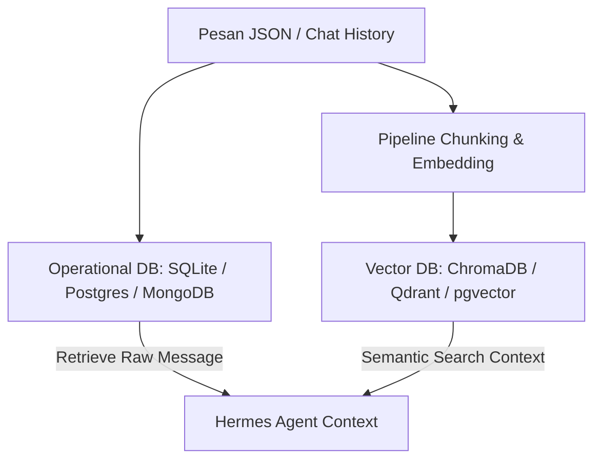

# Rekomendasi Database untuk Menyimpan Chat History JSON/JSONL

Dokumen ini berisi rekomendasi database terbaik untuk menyimpan chat history berformat JSON/JSONL (seperti `chat_history.jsonl`) dalam pengembangan **Hermes AI Orchestrator** atau aplikasi RAG (Retrieval-Augmented Generation).

---

## 1. PostgreSQL (Rekomendasi Utama & Paling Serbaguna)

Jika Anda membangun aplikasi berskala produksi yang membutuhkan kestabilan relasional sekaligus fleksibilitas JSON, **PostgreSQL** adalah pilihan terbaik.

* **Penyimpanan JSON Efisien:** Memiliki tipe data `JSONB` (Binary JSON) yang di-kompres dan mendukung pengindeksan cepat (menggunakan **GIN Index**). Anda bisa melakukan pencarian kueri di dalam objek JSON dengan performa sangat tinggi.
* **Kelebihan Utama untuk RAG:** PostgreSQL mendukung ekstensi **`pgvector`**. Dengan ini, Anda bisa menyimpan data percakapan mentah (*operational data*) sekaligus representasi vektornya (*vector embeddings*) di dalam satu database yang sama. Anda tidak perlu mengelola server database terpisah untuk RAG.

---

## 2. MongoDB (Terbaik untuk Skema Dinamis & Native Document)

Jika struktur chat Anda dinamis, sering berubah, atau Anda mengintegrasikan banyak platform (seperti Telegram, Discord, Slack) yang memiliki skema metadata berbeda-beda.

* **Penyimpanan Native JSON:** MongoDB menggunakan format BSON (Binary JSON). Setiap baris dari file JSONL dapat langsung dimasukkan tanpa perlu mendefinisikan skema tabel terlebih dahulu.
* **Skalabilitas Tinggi:** Sangat mudah melakukan *horizontal scaling* (sharding) jika volume data obrolan tumbuh sangat besar hingga jutaan baris data.

---

## 3. SQLite (Terbaik untuk Aplikasi Lokal / CLI / Desktop)

Jika Hermes dirancang sebagai aplikasi *local-first*, alat bantu baris perintah (CLI), atau aplikasi desktop ringan yang tidak membutuhkan instalasi database server yang kompleks.

* **Tanpa Konfigurasi (Serverless):** Seluruh database disimpan dalam satu file lokal. Sangat mudah dipindahkan atau didistribusikan bersama kode sumber aplikasi Anda.
* **Dukungan JSON Native:** SQLite modern telah dilengkapi dengan modul JSON bawaan yang memungkinkan Anda melakukan kueri langsung terhadap nilai di dalam kolom JSON menggunakan fungsi seperti `json_extract()`.

---

## Strategi Arsitektur RAG (Hybrid Database Approach)

Dalam arsitektur RAG seperti yang dijelaskan di [hermes_rag_architecture.md](file:///c:/Users/eksad/OneDrive/Documents/GitHub/hermes-knowledge/hermes_rag_architecture.md), sangat disarankan untuk memisahkan peran penyimpanan database:

1. **Operational Database:** Menyimpan data mentah historis obrolan secara lengkap beserta metadatanya (seperti *session ID*, *timestamps*, dan *roles*).
2. **Vector Database:** Menyimpan hasil potongan pesan (*chunks*) yang telah diubah menjadi vektor (*embeddings*) untuk keperluan pencarian semantik (misal: mencari percakapan masa lalu yang mirip dengan topik saat ini).

### Rekomendasi Skenario Implementasi:

* **Skenario Ringan / Lokal:** Gunakan **SQLite** sebagai database operasional lokal dan **ChromaDB** sebagai vector database lokal.
* **Skenario Server / Produksi:** Gunakan **PostgreSQL** dengan ekstensi **`pgvector`** sebagai solusi terpadu untuk data operasional sekaligus pencarian vektor.
